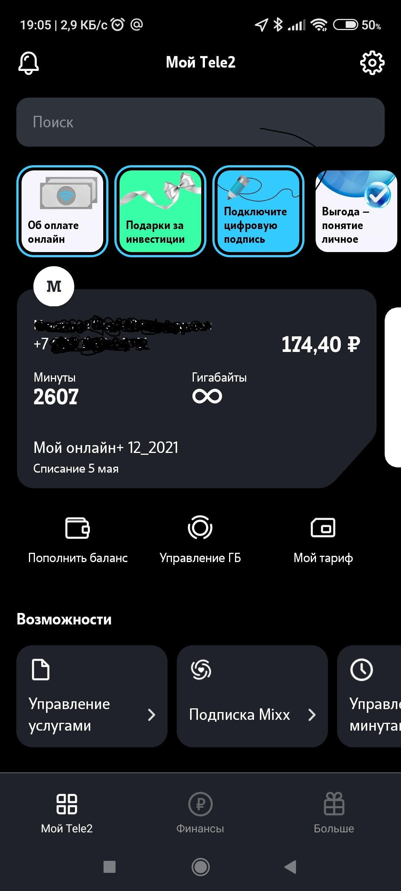

# Инструкция для работы с Markdown

## Выделение текста

Чтобы выделить текст курсивом необходимо обрамить его (*) или (\_). Например, *вот так\* или _вот так_.

Чтобы выделить текст полужирным, необходимо его обрамить (**) или (\_\_). Например, **вот так\*\* или **вот так**.

Альтернативные способы выделения текста нужны для того, чтобы мы могли совмещать оба этих способа. Например, _текст может быть выделен курсивом и при этом, быть **полужирным**_.

## Списки

Чтобы выделить ненумерованный список используйте (\*)

## Работа с изображениями

Чтобы вставить изображение в текст, достаточно написать следующее:

## Ссылки

## Работа с таблицами

## Цитаты

## Заключение
